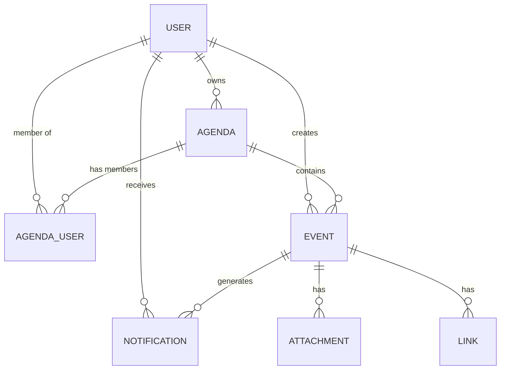

# Architecture & Design

## System Overview

Synapse Agenda uses a **Microservices-ready** architecture with a clear separation between Frontend (React) and Backend (Node.js/Express).

- **Database**: PostgreSQL with Prisma ORM.
- **Auth**: JWT (Access + Refresh tokens).
- **State**: TanStack Query for server state management.

## Data Model (ERD)

### Key Enums

- **AgendaType**: `PERSONAL`, `LABORAL`, `EDUCATIVA`, `FAMILIAR`, `COLABORATIVA`.
- **AgendaRole**: `OWNER`, `CHIEF`, `EMPLOYEE`, `PROFESSOR`, `STUDENT`, `VIEWER`, `EDITOR`.
- **EventStatus**: `CONFIRMED`, `PENDING_APPROVAL`, `REJECTED`, `CANCELLED`.

## Permissions Matrix

| Action             | PERSONAL      | LABORAL           | EDUCATIVA |
| ------------------ | ------------- | ----------------- | --------- |
| **Create Event**   | Owner, Editor | Chief, Employee\* | Professor |
| **Edit Event**     | Owner, Editor | Chief, Creator    | Professor |
| **Delete Event**   | Owner         | Chief, Creator    | Professor |
| **Approve/Reject** | N/A           | Chief Only        | N/A       |
| **Invite Users**   | Owner         | Chief             | Professor |

_\*Employee events start as `PENDING_APPROVAL`._

## Notification System

Notifications are triggered by specific actions and targeted to relevant users.

| Type                     | Trigger                       | Recipient          |
| ------------------------ | ----------------------------- | ------------------ |
| `EVENT_APPROVAL_REQUEST` | Employee creates event        | Agenda Chief       |
| `EVENT_APPROVED`         | Chief approves event          | Event Creator      |
| `EVENT_REJECTED`         | Chief rejects event           | Event Creator      |
| `EVENT_DELETED`          | Event deleted                 | All Agenda Members |
| `AGENDA_DELETED`         | Agenda deleted                | All Agenda Members |
| `AGENDA_INVITE`          | User invited to agenda        | Invited User       |
| `NEW_EVENT_NOTIFICATION` | Event created (auto-approved) | All Agenda Members |

## Timezone Handling

- **Database**: Stores all times in UTC.
- **API**: Returns ISO 8601 UTC strings.
- **Frontend**: Converts to user's local time for display.

## Project Structure

- `backend/`: Node.js/Express API.
  - `src/`: Source code.
  - `prisma/`: Database schema and migrations.
  - `scripts/`: Backend utility scripts (e.g., docker-entrypoint).
- `frontend/`: React/Vite application.
  - `src/`: Source code.
  - `scripts/`: Frontend utility scripts.
- `scripts/`: Global project scripts (e.g., seeding).
- `docs/`: Project documentation.
