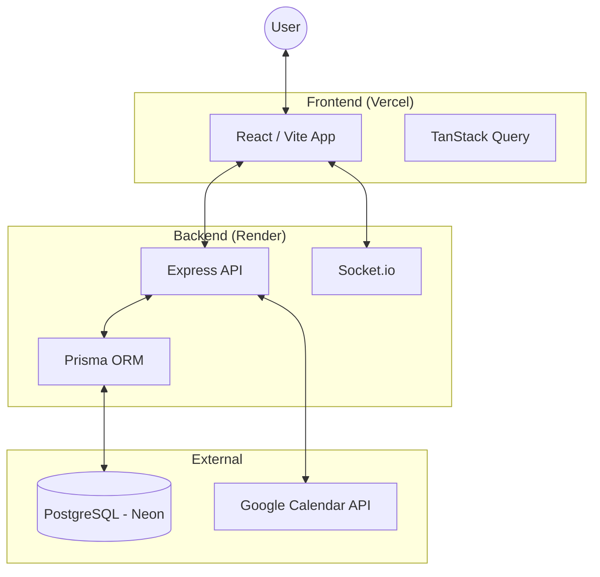

# 🏗️ System Architecture

Synapse is designed as a modular **Full-Stack Application** with a clear separation of concerns between the client and the server.

## 🏛️ High-Level Design

The system follows a classic **Client-Server** pattern, enhanced with real-time capabilities via WebSockets.

## 📦 Components Detail

### 1. Frontend (React)
- **State Management**: Uses `TanStack Query` for server state (caching, background syncing) and standard `React Hooks` for UI state.
- **Routing**: `react-router-dom` handles navigation.
- **Styling**: Vanilla CSS (modular) for maximum performance and custom control.
- **Icons**: `lucide-react`.

### 2. Backend (Node.js)
- **Framework**: `Express` for routing and middleware.
- **ORM**: `Prisma` ensures type-safety and handles migrations.
- **Real-time**: `Socket.io` manages live notifications and event updates.
- **Auth**: `jsonwebtoken` (JWT) for session management and `passport` for Google OAuth.

### 3. Real-time Logic
Synapse uses rooms in Socket.io to target notifications. When a user connects, they are automatically joined to a room named `user:[userId]`. Any action (approval, invite, etc.) emits an event to that specific room.

## 🔒 Security Principles
- **JWT tokens** are stored in the client and sent via `Authorization` headers.
- **Password Hashing**: Uses `bcryptjs` for secure storage.
- **Prisma Middlewares**: Ensure that sensitive fields (like passwords) are not accidentally returned in API responses.
- **Input Validation**: `express-validator` is used in critical endpoints to prevent injection and malformed data.
