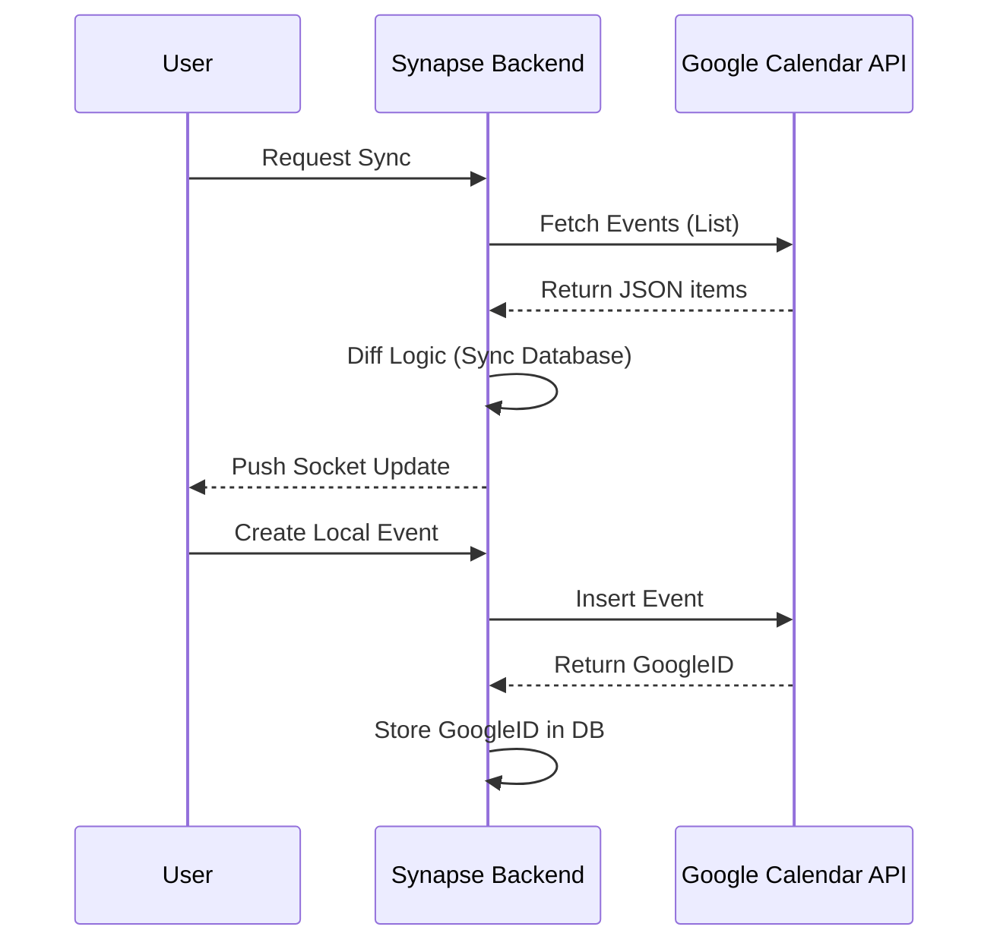

# 🔄 System Flows

This document details the complex logical flows within Synapse.

## 🔑 1. Authentication Flow

Synapse uses a dual-layer authentication strategy: **Email/Password** and **Google OAuth 2.0**.

### Email/Password
1. User sends credentials to `/api/auth/login`.
2. Backend validates via `bcryptjs`.
3. Backend generates a **JWT Access Token** (short-lived) and a **Refresh Token** (long-lived).
4. Tokens are returned to the client and stored in `localStorage` or secure cookies.

### Google OAuth
1. User clicks "Login with Google".
2. Frontend redirects to `/api/auth/google`.
3. Google redirects back to `/api/auth/google/callback` with a code.
4. Backend exchanges code for `googleAccessToken` and `googleRefreshToken`.
5. User is logged in (or registered) and Synapse tokens are issued.

## 📅 2. Google Calendar Synchronization

Sync is **Bi-directional** but triggered by events or manual import.

### Key Logic:
- **Webhooks**: Synapse registers a `Watch` channel in Google. When someone changes something in Google, Google sends a POST to our `/api/integrations/google/webhook`.
- **Deduplication**: Uses `googleEventId` as a unique constraint to avoid duplicate imports.

## 📧 3. Laboral Approval Workflow

Specifically for `LABORAL` agendas.

1. **Employee** creates an event.
2. Backend checks `AgendaType`:
    - If `LABORAL` and user is `EMPLOYEE`, set `status = PENDING_APPROVAL`.
3. Backend triggers `NotificationService`:
    - Finds all users with role `CHIEF` in that agenda.
    - Creates a notification for them.
    - Emits a Socket event to the Chiefs.
4. **Chief** approves:
    - Sets `status = CONFIRMED`.
    - Triggers notification to the **Employee**.
