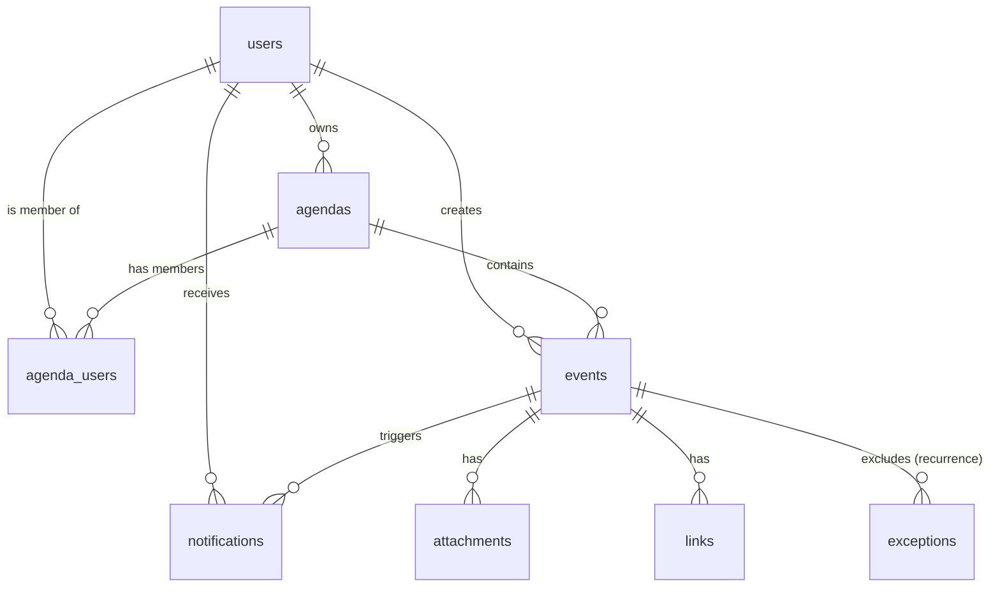

# 📊 Data Models

The Synapse data model is optimized for collaborative scheduling and role-based access control.

## 📐 Entity Relationship Diagram (ERD)

## 📋 Core Models

### User (`users`)
Stores profile information and authentication tokens.
- `googleId`: Unique ID for Google OAuth users.
- `status`: `AVAILABLE`, `AWAY`, `BUSY`.

### Agenda (`agendas`)
The container for events. Can be shared with multiple users.
- `type`: `PERSONAL`, `LABORAL`, `EDUCATIVA`, `FAMILIAR`, `COLABORATIVA`.
- `googleCalendarId`: Link to a Google Calendar for bi-directional sync.

### Event (`events`)
Individual entries within an agenda.
- `status`: `CONFIRMED`, `PENDING_APPROVAL`, `REJECTED`, `CANCELLED`.
- `recurrenceRule`: RRULE string for recurring events.

## 🏷️ Essential Enums

### AgendaType
Determines the business logic (e.g., approval workflows).
- **PERSONAL**: Only for the owner.
- **LABORAL**: Requires `Chief` approval for `Employee` events.
- **EDUCATIVA**: Separates `Professor` and `Student` views.

### AgendaRole
Defines permissions within a shared agenda.
- **OWNER**: Full control.
- **CHIEF**: Can approve/reject and manage members.
- **EDITOR**: Can create and edit events.
- **VIEWER**: Read-only access.

## 🔔 Notification System
Notifications are polymorphic and link to either an `Agenda` or an `Event`.
- **Types**: `AGENDA_INVITE`, `EVENT_CREATED`, `EVENT_UPDATED`, `ROLE_CHANGED`, `EVENT_APPROVED`, etc.
- **Data**: Stores JSON metadata for dynamic message rendering.
