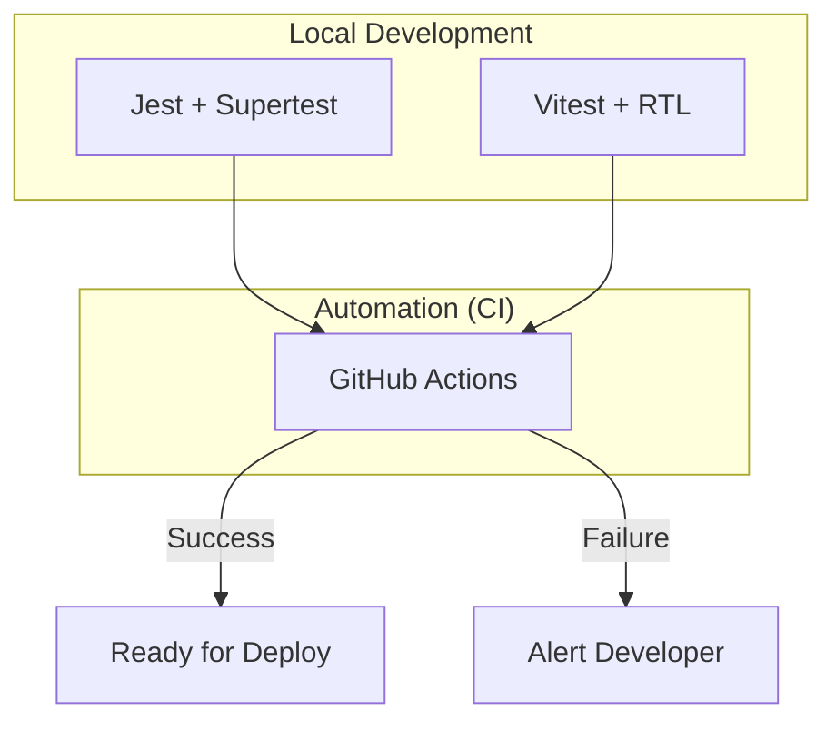

# 🧪 Testing & CI/CD Strategy

Synapse uses a multi-layered testing strategy to ensure reliability across the entire stack. All tests are automatically executed on every push to GitHub.

## 🏛️ Testing Architecture



---

## 🖥️ Backend Testing (API)
We use **Jest** for the test runner and **Supertest** for HTTP assertions.

- **Location**: `backend/src/test/*.test.js`
- **Focus**: 
    - API Endpoint integrity (status codes, JSON structure).
    - Business logic validation (permissions, approval flows).
    - Database constraints (Prisma interactions).

### How to run:
```bash
cd backend
npm test
```

---

## 🎨 Frontend Testing (UI)
We use **Vitest** for speed and **React Testing Library (RTL)** for component interaction.

- **Location**: `frontend/src/test/`
- **Focus**:
    - Component rendering and user interactions.
    - State management logic (TanStack Query hooks).
    - UI consistency across different user roles.

### How to run:
```bash
cd frontend
npm test
```

---

## 🤖 Continuous Integration (GitHub Actions)
The workflow is defined in `.github/workflows/ci.yml`.

### Workflow Stages:
1. **Checkout**: Pulls the latest code from the repository.
2. **Setup**: Installs Node.js and caches dependencies for faster execution.
3. **Backend Pipeline**: Installs dependencies and runs `npm test` in the `/backend` folder.
4. **Frontend Pipeline**: Installs dependencies and runs `npm test` in the `/frontend` folder.

**Strict Rule**: No code can be merged into `main` if the CI pipeline fails. This ensures the production environment (Render/Vercel) always stays stable.

---

## 💡 Best Practices for New Tests
- **Isolation**: Each test should be independent.
- **Naming**: Use clear descriptions: `test('should reject event if user has conflict', ...)`
- **Mocks**: Use `jest.mock()` or `vi.mock()` for external services like Google API to keep tests fast and predictable.
