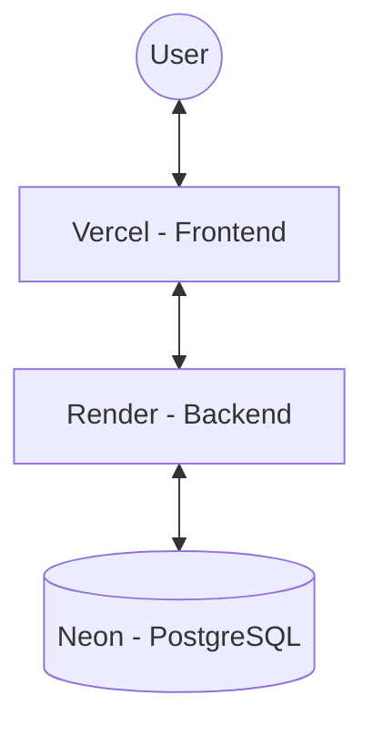

# ☁️ Cloud Setup (Current Infrastructure)

Synapse currently uses a distributed cloud architecture optimized for the **free tier** of major providers.

## 📐 Current Infrastructure Map

## 🛠️ Provider Details

### 1. Frontend: [Vercel](https://vercel.com)
- **Repo Connection**: Connected to the `Synapse` GitHub repository.
- **Root Directory**: Configured as `/frontend`.
- **Environment Variables**:
  - `VITE_API_URL`: Points to the Render backend URL.

### 2. Backend: [Render](https://render.com)
- **Service Type**: Web Service.
- **Root Directory**: Configured as `/backend`.
- **Runtime**: Node.
- **Build Command**: `npm install && npx prisma generate`
- **Start Command**: `npx prisma migrate deploy && npm start`
- **Auto-Sync**: Uses `npx prisma db push` during critical updates to ensure schema matching.

### 3. Database: [Neon](https://neon.tech)
- **Type**: Serverless PostgreSQL.
- **Connection**: Managed via the `DATABASE_URL` environment variable in Render.
- **Migrations**: Controlled by Prisma from the Render environment.

## ⚠️ Important Considerations for Free Tiers
- **Render Spin-up**: The backend on Render (Free tier) goes to sleep after 15 minutes of inactivity. The first request after a long break may take **30-60 seconds** to respond.
- **Neon Connections**: Serverless Postgres has a connection limit. Prisma is configured to handle connection pooling effectively.
- **Vercel Rewrites**: The `vercel.json` file in `/frontend` handles Single Page Application (SPA) routing to ensure `index.html` is served for all paths.

## 🔄 Deployment Workflow
1. Developer pushes code to `main` branch on GitHub.
2. Vercel automatically builds and deploys the frontend.
3. Render automatically builds and deploys the backend, applying any new Prisma migrations to Neon.
