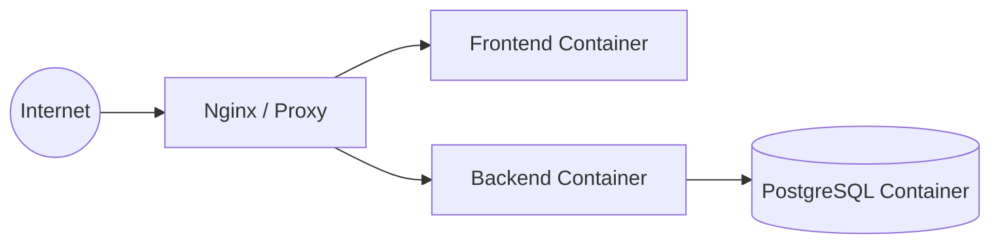

# 🐳 Production Deployment (Docker)

For production environments, Synapse uses Docker Compose to ensure a consistent and isolated environment.

## 🏗️ Architecture in Docker



## 🚀 Deployment Steps

### 1. Configure Environment
Ensure your `.env` file contains production-ready secrets:
- `NODE_ENV=production`
- `JWT_SECRET`: A long, random string.
- `DATABASE_URL`: Points to the `postgres` service within the Docker network.

### 2. Launch Services
```bash
docker-compose up -d --build
```
This will:
1. Build the frontend and backend images.
2. Initialize the PostgreSQL database.
3. Run Prisma migrations automatically.
4. Expose the app (default: `http://localhost:5173`).

## 🛠️ Docker Details

### Healthchecks
The `postgres` service includes a healthcheck to ensure the backend only starts once the database is ready to accept connections.

### Volumes
- `postgres_data`: Persistent storage for the database.
- `./backend` & `./frontend`: Mounted for development, but should be removed or changed to `COPY` in a pure production Dockerfile.

### Resources
The backend is limited to **1GB of RAM** in the `docker-compose.yml` to prevent memory leaks from crashing the host system.

## 🔒 Security Recommendations
1. **Nginx/SSL**: Always use a reverse proxy (like Nginx, Traefik, or Caddy) with SSL (HTTPS) in front of the Docker setup.
2. **Secrets**: Use Docker Secrets or environment variable injection from a CI/CD pipeline instead of hardcoding `.env` files.
3. **Database Backups**: Regularly dump the `postgres_data` volume.
